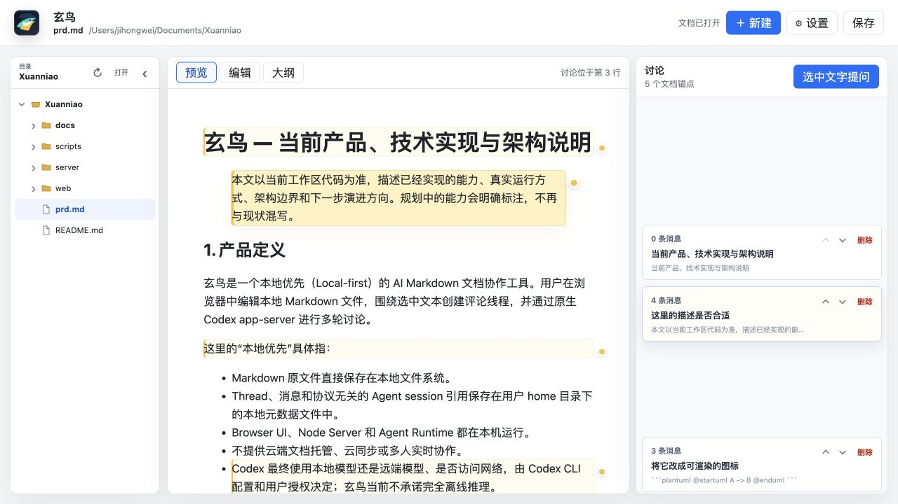
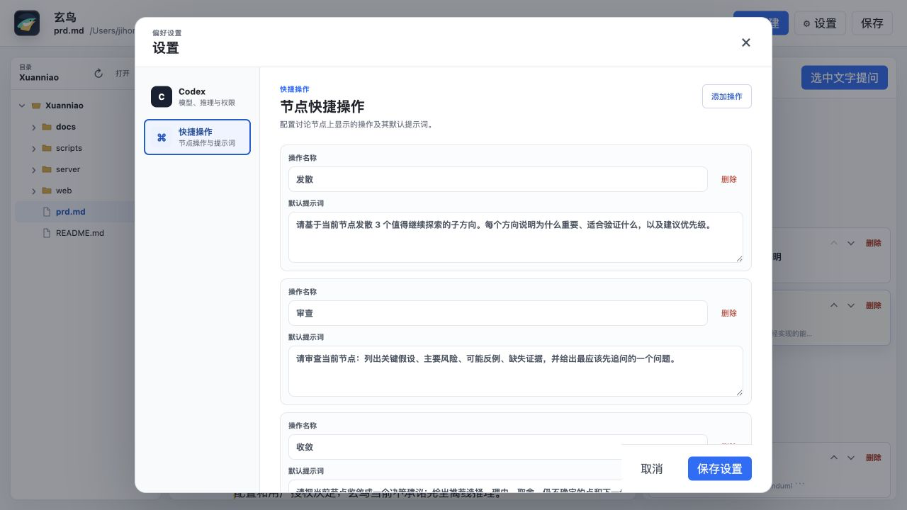

# 玄鸟 Xuanniao

在本地 Markdown 文档上建立可分支、可追溯的 Codex 讨论树。

Xuanniao is a local-first Markdown workspace for branching, traceable document discussions with Codex.

玄鸟以文档而不是聊天窗口为中心：打开本地目录和 Markdown 文件，围绕具体文本创建讨论，再把问题、回答与后续追问组织成一棵多叉树。它适合 PRD、RFC、ADR、技术方案、接口设计和测试规划等需要持续推演的工作。

## 当前界面

### 文档工作区

最左侧是可收起的目录树，用于切换目录和 Markdown 文件；中间是默认打开的预览，也可以切换到编辑或大纲；右侧评论卡片与文档位置同步。编辑和预览切换时会保留文档位置。

[](docs/images/xuanniao-workspace.png)

### 讨论树

点击评论卡片进入讨论详情。详情页按 `3:5:2` 展示锚定文档、当前节点内容和讨论树；根节点会默认选中。点击任意节点可切换内容，输入新问题时 Tree 会实时展示预览节点。

[](docs/images/xuanniao-thread-tree.png)

### 设置

Codex 模型、推理深度和权限都使用下拉列表。快捷操作有独立设置项，可以增加、删除或修改操作名称与默认提示词；点击“保存设置”后从下一轮提问生效。

[](docs/images/xuanniao-settings.png)

## 核心能力

- **Local-first**：Markdown 原文件和讨论元数据保存在本机。
- **目录工作区**：打开目录后持续显示文件树，点击目录展开或收起，点击 Markdown 文件直接切换；整栏可以折叠。
- **Markdown-native**：CodeMirror 编辑源文本，markdown-it 渲染预览，Mermaid 图可独立放大查看。
- **默认预览**：首次打开、切换文档或刷新页面时默认使用预览模式；预览与编辑保持滚动位置同步。
- **自然语言新建文档**：描述目标后，Codex 可以检查当前仓库及用户引用的 Issue、PR 或其它资料，生成首版 Markdown。
- **文本锚定**：Thread 绑定文档选区，并随浏览器编辑或 Codex 修改自动更新位置。
- **树形讨论**：每个问题都是独立节点；叶子创建子节点，已有子路径的节点创建并列分支。
- **节点类型**：根节点和子节点都可以标记为问题、想法、假设、证据、风险、决策或任务，并参与 Tree 统计。
- **选区追问**：在文档、节点问题或回答中划选文字，直接创建带引用的追问。
- **可配置快捷操作**：内置发散、审查、收敛和转任务，也可以在设置中自由增删并修改提示词。
- **直接执行与修改**：在节点中要求实现、修复、重构、测试或改写文档，Codex 可按当前权限检查仓库并修改文件。
- **执行过程可见**：计划、命令、文件变化、Diff、搜索和 Subagent 生命周期通过 SSE 实时展示，完成后随回复折叠留档。
- **原生 Codex 会话**：只支持 Codex app-server，以原生 thread start/resume/fork 保持各讨论分支的语义上下文。

## 快速开始

### 要求

- Node.js 20.19.x，或 22.12 及更高版本
- npm
- 已安装并登录的 Codex CLI

```bash
npm ci
codex login
codex --version
make run
```

浏览器默认打开 `http://127.0.0.1:5173`，初始文档为 `prd.md`。

打开其它 Markdown 文件：

```bash
make run FILE=docs/example.md
```

端口被占用时：

```bash
make run SERVER_PORT=4174 WEB_PORT=5174
```

## 使用流程

1. 点击顶栏文档名称打开目录或 Markdown 文件，也可以点击“新建”用自然语言生成文档。
2. 在预览或编辑中选择一段文字。
3. 点击“选中文字提问”，输入根问题并交给 Codex。
4. 从右侧评论卡片进入讨论树，默认展示根节点内容。
5. 点击 Tree 节点切换上下文；叶子节点继续创建子节点，非叶节点创建新分支。
6. 使用快捷操作填入预设提示词，或直接输入分析、写作、修改与开发要求。
7. Codex 需要额外权限时在页面内批准或拒绝；执行结果、过程和文档变化会保存到对应节点。

主要交互：

- `Esc`：关闭选区提问框；没有提问框时直接退出讨论详情。
- 拖动讨论详情的两条分隔线：调整文档、节点内容和 Tree 的宽度。
- 拖动 Tree 背景：平移画布。
- 普通滚轮：移动画布。
- `Command/Ctrl + 滚轮`：缩放画布。
- 方向键：在父节点、第一子节点和相邻兄弟节点之间移动。

## 架构

```text
┌──────────────────────────── Browser / React ────────────────────────────┐
│ WorkspaceTree · DocumentPane · ThreadRail · Settings · DiagramViewer   │
│ CodeMirror · markdown-it · Mermaid · anchor remapping                  │
└────────────────────────── REST + Agent Run SSE ─────────────────────────┘
                                      │
┌──────────────────────────── Node HTTP Server ───────────────────────────┐
│ document I/O · conversation domain · metadata persistence              │
│ document transactions · permission broker · context policy             │
└──────────────────────────── JSON-RPC / JSONL ────────────────────────────┘
                                      │
                         Codex app-server (native)
```

| 层 | 主要文件 | 职责 |
| --- | --- | --- |
| UI 组合 | `web/src/App.tsx` | 组合目录、文档、讨论、设置、权限和新建文档流程 |
| 文档视图 | `web/src/components/WorkspaceTree.tsx`, `DocumentPane.tsx` | 目录导航以及预览、编辑、大纲切换 |
| 文档编辑 | `web/src/ThreadEditor.ts` | CodeMirror、选区、装饰、滚动和 anchor remap |
| 讨论交互 | `web/src/components/ThreadRail.tsx` | 评论卡片、三栏详情、无限画布、节点内容和快捷操作 |
| 树布局 | `web/src/thread-tree.ts`, `thread-canvas.ts` | 会话树构建、导航、分支规则和空间布局 |
| Markdown | `web/src/markdown.ts` | Markdown、代码块和按需加载的 Mermaid |
| 前端用例 | `web/src/hooks/` | 文档保存、会话命令、设置、权限与选区生命周期 |
| HTTP 入口 | `server/index.js` | REST/SSE 适配、活动文档切换和依赖组合 |
| 会话领域 | `server/lib/conversation-model.js`, `conversation-service.js` | 节点状态迁移、分支一致性和 Agent 回合编排 |
| 文档事务 | `server/lib/document-workspace.js` | revision、原子写入、快照对比和锚点重映射 |
| 持久化 | `server/lib/thread-store.js` | Thread JSON 读写、锁和 mutation 串行化 |
| Agent 运行时 | `server/lib/codex-app-server-runtime.js` | app-server 生命周期、thread/turn、事件、超时和审批 |
| 上下文策略 | `server/lib/agent-context.js` | 文档快照、增量变化、选区、问题和引用来源说明 |
| 运行事件 | `server/lib/agent-run-broker.js` | 有界事件缓存、SSE 订阅和完成态保留 |

## 数据与会话

Markdown 直接读写用户选择的原文件。讨论数据按文档绝对路径的 SHA-256 保存到：

```text
~/xuanniao/<document-path-sha256>/threads.json
```

全局设置保存到：

```text
~/xuanniao/settings.json
```

每个讨论节点保存父节点、问题、回答、引用、节点类型、Codex thread/turn checkpoint、文档快照哈希和执行过程。当前会话策略是：

- 根节点使用 `thread/start`。
- 线性子节点恢复父分支并继续执行。
- 从历史节点创建分支时使用 `thread/fork` 复制精确 turn。
- 服务重启后使用 `thread/resume` 恢复。
- 修改或删除历史消息时失效受影响的 checkpoint，避免可见树与 Codex 历史不一致。
- Agent 完成时校验分支 revision；运行期间上下文发生变化时，旧结果不会覆盖新状态。

## 上下文与文件修改

新 session 首轮会发送完整 Markdown，确保 Codex 理解文档；后续在原生会话历史上只补充当前问题、选区和必要的文档变化。小范围变化使用精确 splice，大范围变化或缺少快照时重新同步完整文档。超过显式字符预算会直接报错，不会静默截断。

文档与讨论是基础上下文。当用户要求检查实现、修复代码，或提供本地仓库、Issue、PR 等引用时，Codex 可以在权限允许的范围内继续读取相关代码和远程资料。

普通回合允许 Codex 直接修改活动 Markdown 或仓库文件。玄鸟在回合前后比较文档快照，通过 `DocumentWorkspace` 协调内容 revision、原子保存和所有 Thread anchor；发现无法归因的并发写入时保留磁盘内容并返回冲突。

## 设置与环境变量

设置页提供：

- 模型：从 Codex `model/list` 动态读取。
- 推理深度：根据所选模型的能力展示。
- 权限：请求批准、替我审批、完全访问权限或使用 `config.toml`。
- 快捷操作：自定义按钮名称和默认提示词，支持增加与删除。

修改只保存在表单草稿中，点击“保存设置”后才会写入本机设置文件，并从下一轮提问生效；不会中断正在执行的任务。

也可以通过环境变量提供首次启动默认值：

```bash
XUANNIAO_CODEX_CMD="/path/to/codex app-server" \
XUANNIAO_CODEX_MODEL="<model-id>" \
XUANNIAO_CODEX_REASONING_EFFORT="high" \
XUANNIAO_AGENT_PERMISSION_MODE="auto-review" \
npm start -- prd.md
```

其它运行参数：

```bash
XUANNIAO_AGENT_TIMEOUT_MS=300000 \
XUANNIAO_AGENT_CONTEXT_MAX_CHARS=1500000 \
XUANNIAO_AGENT_SNAPSHOT_CACHE_ENTRIES=32 \
npm start -- prd.md
```

服务默认只监听回环地址。确需在可信网络暴露时必须显式确认风险：

```bash
HOST=0.0.0.0 XUANNIAO_UNSAFE_ALLOW_REMOTE=1 npm start -- prd.md
```

该模式不包含用户认证，不能作为多租户服务公开部署。

## 开发

手动启动 API 和 Vite：

```bash
npm start -- prd.md
XUANNIAO_API_HOST=127.0.0.1 XUANNIAO_API_PORT=4173 npm run web:dev
```

完整检查：

```bash
npm run check
```

该命令依次执行服务端语法检查、TypeScript 检查、格式检查、单元测试和 Vite 生产构建。

## 当前限制

- 当前是单用户、单 Server 实例、单活动文档。
- Thread 使用本地 JSON 整文件持久化，适合当前个人工作流。
- Codex 直接修改文档后会自动协调锚点，但还没有修改前的 Diff 确认和跨回合 undo。
- 没有文件 watcher；外部修改在下一次保存或 Agent 回合结束时发现。
- 尚未为 Codex `request_user_input`、MCP elicitation 和动态 client tool 提供专用 UI。
- Local-first 只描述文档与玄鸟元数据的存储位置；模型执行和网络访问仍取决于 Codex 配置与用户授权。

---

## English

Xuanniao is a document-centered, local-first Markdown workspace. Open a directory, select text in a Markdown document, ask Codex, and organize follow-up questions as a navigable conversation tree.

It provides a collapsible file tree, preview/edit/outline views, anchored discussions, multi-way branches, configurable node quick actions, native Codex app-server sessions, permission controls, live run timelines, direct document edits, and automatic anchor reconciliation.

```bash
npm ci
codex login
make run
```

Then open `http://127.0.0.1:5173`.
