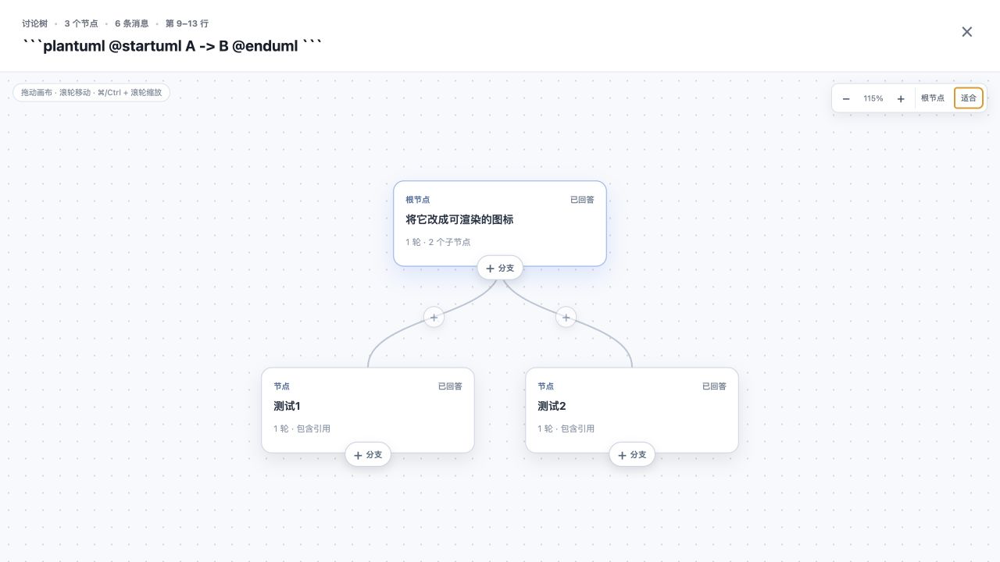
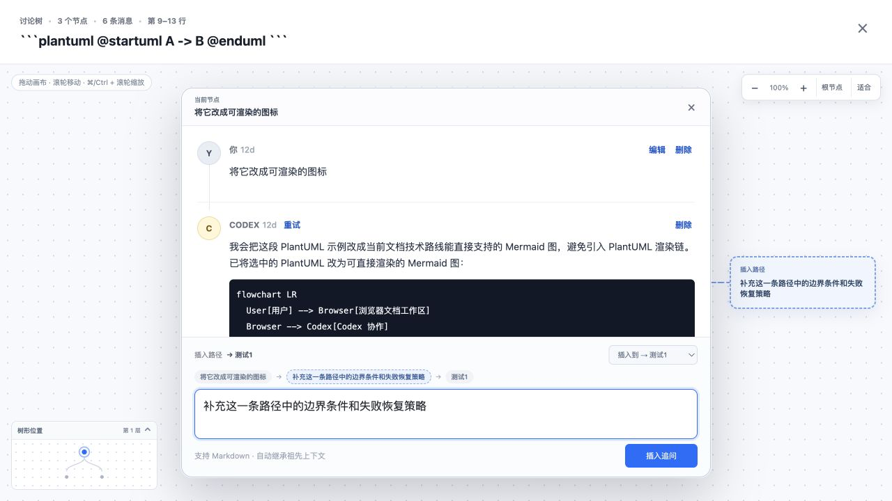

# 玄鸟 Xuanniao

在本地 Markdown 文档上建立可分支、可追溯的 Codex 讨论树。

Xuanniao is a local-first Markdown workspace for branching, traceable document discussions with Codex.

玄鸟以文档而不是聊天窗口为中心：打开本地 Markdown 文件，围绕具体文本创建讨论，再把问题、回答和后续追问组织成一棵多叉树。它适合 PRD、RFC、ADR、技术方案、接口设计和测试规划等需要持续推演的文档工作。

## 核心体验

- **Local-first**：Markdown 原文件和讨论元数据保存在本地。
- **Markdown-native**：使用 CodeMirror 编辑源文本，以 markdown-it 和 Mermaid 渲染预览。
- **文本锚定**：Thread 绑定文档选区，并随编辑自动更新位置。
- **树形讨论**：每个问题都是节点，可以继续分支，也可以在既有路径中插入追问。
- **局部上下文**：每个节点继承祖先上下文，不会混入无关兄弟分支。
- **选区追问**：可以在节点的问题或回答中划选文字，直接创建带引用的追问。
- **空间化导航**：支持无限画布、平移、缩放、节点焦点、面包屑和树形缩略图。
- **受控文档修改**：Codex 可以返回限定范围的 replacement，由玄鸟应用并同步 Thread anchor。

## 界面

### 文档工作区

左侧编辑或预览 Markdown，右侧 Thread 与文档位置保持对应。只有从文档选区发起“选中文字提问”才会创建新的根 Thread。

### 讨论树总览

点击 Thread 进入全屏画布。节点底部的 `＋ 分支` 创建新的子分支，连线上的 `＋` 在指定路径中插入节点。

[](docs/images/xuanniao-thread-tree.png)

### 节点焦点与路径预览

点击节点后，节点在同一画布中进入焦点模式。输入问题时会同时显示路线预览和幽灵节点；可以选择新建分支，或插入某条既有路径。

[](docs/images/xuanniao-node-focus.png)

## 交互语义

玄鸟明确区分节点操作和路径操作：

```text
从节点创建分支

    B
   / \
  C   D
```

```text
在路径中插入追问

A → B → C
      ↓
A → B → D → C
```

- 点击节点：进入该节点的阅读与追问焦点。
- 点击节点底部 `＋ 分支`：创建新的子分支，不移动既有子节点。
- 点击连线 `＋`：在父子节点之间插入新节点。
- 节点没有子节点时直接创建子节点；只有一个子节点时默认继续当前路径；存在多个子节点时必须选择插入路径或另建分支。
- 划选问题或回答中的文字：出现带引用的内联提问框。
- `Esc`：从节点焦点返回树总览，再次按下关闭 Thread 工作区。
- 拖动背景：平移画布。
- 普通滚轮：移动画布。
- `Command/Ctrl + 滚轮`：缩放画布。
- 方向键：在父节点、第一子节点和相邻兄弟节点之间移动。

## 快速开始

### 要求

- Node.js 20 或更高版本
- npm
- Codex CLI

安装依赖：

```bash
npm ci
codex login
codex --version
```

启动：

```bash
make run
```

默认打开：

```text
http://127.0.0.1:5173
```

默认文档为 `prd.md`。打开其他 Markdown 文件：

```bash
make run FILE=docs/example.md
```

如果端口已被占用：

```bash
make run SERVER_PORT=4174 WEB_PORT=5174
```

## 使用流程

1. 打开本地 Markdown 文件。
2. 在 Edit 或 Preview 中选择一段文字。
3. 点击“选中文字提问”，在选区旁的提问框中创建根 Thread 并向 Codex 提问。
4. 从评论栏打开 Thread，进入讨论树画布。
5. 点击节点查看问题和回答，或在节点与连线上创建新的讨论路径。
6. 在问题或回答中划选文字，基于精确引用继续追问。
7. 明确使用“修改、改写、翻译、替换”等意图时，Codex 可以更新锚定的文档范围。

## 架构

```text
┌──────────────────────────── Browser / React ────────────────────────────┐
│ DocumentPane · ThreadRail · Thread Canvas · FilePicker · Diagram Viewer │
│ CodeMirror · markdown-it · Mermaid · anchor remapping                   │
└─────────────────────────────── fetch /api ───────────────────────────────┘
                                      │
┌──────────────────────────── Node HTTP Server ───────────────────────────┐
│ document I/O · thread tree · path insertion · metadata persistence      │
│ Agent Runtime · approval broker · context policy · replacement apply    │
└────────────────────────── semantic runtime API ──────────────────────────┘
                                      │
              Codex app-server (native)  ·  ACP adapter (compatibility)
```

| 层 | 主要文件 | 职责 |
| --- | --- | --- |
| UI 组合 | `web/src/App.tsx` | 组合文档、讨论、权限和文件浏览能力 |
| 浏览器用例 | `web/src/hooks/useDocumentSession.ts`, `useConversationCommands.ts`, `usePermissionInbox.ts` | 文档保存事务、会话命令和权限收件箱 |
| 文档编辑 | `web/src/ThreadEditor.ts` | CodeMirror、选区、装饰和 anchor remap |
| 树形交互 | `web/src/components/ThreadRail.tsx` | 评论栏、无限画布、节点焦点和内联追问 |
| 选区交互 | `web/src/hooks/useMessageSelection.ts` | 消息选区生命周期、引用捕获与提问浮层 |
| 树布局 | `web/src/thread-tree.ts`, `web/src/thread-canvas.ts` | 会话树构建、导航、路径和空间布局 |
| 渲染 | `web/src/markdown.ts` | Markdown、代码块与按需加载的 Mermaid |
| HTTP 适配 | `web/src/api.ts`, `server/index.js` | 请求解析、响应和依赖组合 |
| 会话领域 | `server/lib/conversation-model.js` | 分支放置、树状态迁移和 session 失效规则 |
| 应用服务 | `server/lib/conversation-service.js` | 会话命令、Agent 回合和受控文档修改编排 |
| 文档事务 | `server/lib/document-workspace.js` | revision、原子写、锚点校验和活动文档保护 |
| 持久化 | `server/lib/thread-store.js` | Thread JSON 读写、迁移和并发串行化 |
| Runtime 组合 | `server/lib/agent-runtime.js` | 传输选择、配置归一化和应用边界 |
| JSONL 基础设施 | `server/lib/json-line-rpc-process.js` | 子进程、请求关联、超时和诊断缓冲 |
| 原生 Codex | `server/lib/codex-app-server-runtime.js` | app-server 生命周期、thread/turn、分支、事件和审批 |
| 上下文策略 | `server/lib/agent-context.js` | 文档快照、增量变更、分支历史和受控替换约束 |
| ACP 兼容 | `server/lib/acp-client.js` | ACP session、事件、文件能力和审批适配 |

## 数据与上下文

当前 Markdown 文件直接读写原文件。Thread 数据按文档绝对路径的 SHA-256 保存在：

```text
~/xuanniao/<document-path-sha256>/threads.json
```

每个讨论节点保存：

- 节点 ID 与父节点 ID
- 用户问题和 Codex 回答
- 可选的引用文本与来源消息
- Agent adapter、session ID、最近 turn ID 和文档快照哈希
- 创建时间、错误状态和其它消息元数据

当前实现采用 **conversation-node-level Agent session**：

- 默认使用 Codex `app-server`，但仅在第一次 Agent 请求时按需启动；CLI 不可用不会阻断本地文档编辑。
- 根节点使用 `thread/start`；同一节点连续轮次复用 thread；子分支从父节点最近成功 turn 使用 `thread/fork`。
- Agent session 持久化到 Thread store，服务重启后使用 `thread/resume` 恢复。
- 文档未变化时不重复发送完整正文；小范围变化发送精确 splice，大范围变化重新同步完整快照。
- Agent 上下文超过显式字符预算时会失败并提示，不会静默截断；文档快照使用有界 LRU 缓存。
- 新建或重建分支只注入该路径需要的祖先历史，不包含兄弟分支。
- 编辑、删除问题或在路径中插入节点时，会清除当前节点及受影响后代的陈旧 session，避免 Agent 历史与可见树不一致。
- 原生 Runtime 只按同一 session 串行化；不同分支可以并行运行。持久化写入由 Thread store 串行提交。
- Agent 完成时会校验分支 revision，并原子写入回答与 session；运行期间祖先路径变化的旧回答不会覆盖新上下文。
- 每个文档响应携带内容 revision；浏览器保存和受控替换使用 compare-and-swap，拒绝覆盖并发或外部修改。
- 浏览器锚点只作为候选位置，服务端根据保存后的正文重新校验并生成 canonical anchor。
- 活动 Markdown 文档是受保护资源：ACP 文件写直接拒绝；所有 Agent 回合结束后还会校验 revision，并恢复绕过文档事务的直接写入。
- 文档切换采用请求级上下文快照，旧请求不会写入新文档；Thread metadata 通过临时文件和原子 rename 落盘。
- 原生 turn 超时后先发送 `turn/interrupt`；若 Codex 未在宽限期内停止，会重启 Runtime，避免后台操作继续执行。

ACP 仍作为兼容传输保留，但不支持原生 thread fork，且同一 adapter 进程内的请求会串行执行。Local-first 表示文档和玄鸟元数据保存在本机；模型与网络行为取决于 Codex CLI 或所选 adapter 的配置。

## 文档修改

当用户明确要求修改文档时，玄鸟要求 Codex 返回：

```text
<XUANNIAO_REPLACEMENT>
replacement markdown here
</XUANNIAO_REPLACEMENT>
```

服务端解析 replacement，校验生成回答时的文档 revision，再原子更新 Markdown 并同步所有受影响的 Thread anchor。revision 已变化时拒绝覆盖；完整删除锚定范围时，对应 Thread 也会删除。

## 配置

Agent 默认使用 Codex app-server 与完全访问沙箱：

```bash
make run
```

只读模式：

```bash
XUANNIAO_AGENT_MODE=read-only make run
```

指定 Codex app-server 命令、模型或推理强度：

```bash
XUANNIAO_CODEX_CMD="/path/to/codex app-server" \
XUANNIAO_CODEX_MODEL="<model-id>" \
XUANNIAO_CODEX_REASONING_EFFORT="high" \
npm start -- prd.md
```

切换到 ACP 兼容模式：

```bash
npm install -g @agentclientprotocol/codex-acp
XUANNIAO_AGENT_TRANSPORT=acp \
XUANNIAO_ACP_CMD="/path/to/codex-acp" \
XUANNIAO_ACP_SKIP_AUTH=1 \
npm start -- prd.md
```

调整通用请求超时；ACP 也可以单独覆盖：

```bash
XUANNIAO_AGENT_TIMEOUT_MS=300000 npm start -- prd.md
XUANNIAO_ACP_TIMEOUT_MS=300000 XUANNIAO_AGENT_TRANSPORT=acp npm start -- prd.md
```

调整上下文字符预算和文档快照缓存：

```bash
XUANNIAO_AGENT_CONTEXT_MAX_CHARS=1500000 \
XUANNIAO_AGENT_SNAPSHOT_CACHE_ENTRIES=32 \
npm start -- prd.md
```

服务默认只允许回环地址。确需在可信网络暴露时必须显式确认风险：

```bash
HOST=0.0.0.0 XUANNIAO_UNSAFE_ALLOW_REMOTE=1 npm start -- prd.md
```

远程模式仍定位为可信单用户网络，不等同于具备用户认证的多租户服务。

## 开发

手动启动 API：

```bash
npm start -- prd.md
```

手动启动 Vite：

```bash
XUANNIAO_API_HOST=127.0.0.1 XUANNIAO_API_PORT=4173 npm run web:dev
```

检查：

```bash
npm run check
```

生产构建：

```bash
npm run web:build
```

## 适用场景

- PRD、RFC 和 ADR 的需求澄清与持续推演
- 架构、模块边界、存储和安全模型设计
- API 请求响应、错误码和兼容性讨论
- 正常路径、异常路径、并发、权限和恢复测试规划
- Mermaid 架构图与技术路线审阅
- 本地 Markdown 知识整理和 AI 问答

## 当前限制

- Thread 使用本地 JSON 持久化，适合当前单用户工作流，后续可以迁移到 SQLite。
- 文档修改采用锚定范围 replacement，还不是完整的 patch review 工作流。
- 当前是单用户、单 Server 实例、单活动文档。
- 完全访问是默认模式，但活动 Markdown 文档始终由 Xuanniao 文档事务保护；其它仓库写入能力由 Runtime 沙箱和审批策略控制。
- 当前 Runtime 尚未提供 Codex `request_user_input` 表单、MCP elicitation 和动态 client tool UI；这些能力会在 health capability 中明确报告为 `false`，Agent 仍可退回普通文本提问。

---

## English

Xuanniao is a document-centered, local-first Markdown workspace. Select a range in a local document, ask Codex, and organize follow-up questions as a navigable conversation tree.

Key capabilities:

- local Markdown editing and metadata persistence
- anchored discussions that follow document edits
- multi-way conversation trees
- branch creation and targeted path insertion
- inline follow-ups from selected question or answer text
- native Codex threads with per-node resume/fork semantics
- incremental document context and ancestor-only branch recovery
- user-mediated command, file, and permission approvals
- Markdown, code block, and Mermaid rendering
- controlled selected-range document replacement

Quick start:

```bash
npm ci
codex login
make run
```

Then open `http://127.0.0.1:5173`.
