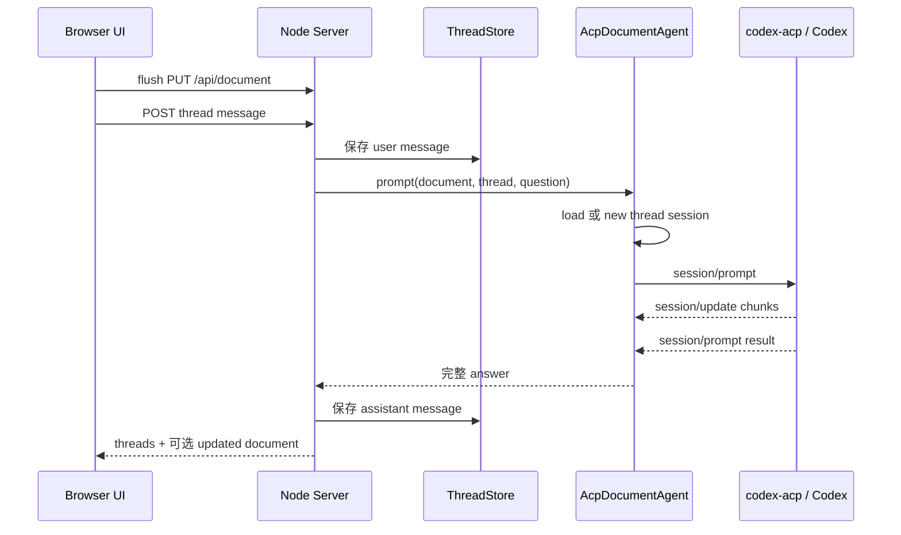

# 玄鸟 — 当前产品、技术实现与架构说明

> 本文以当前工作区代码为准，描述已经实现的能力、真实运行方式、架构边界和下一步演进方向。规划中的能力会明确标注，不再与现状混写。

## 1. 产品定义

玄鸟是一个本地优先（Local-first）的 AI Markdown 文档协作工具。用户在浏览器中编辑本地 Markdown 文件，围绕选中文本创建评论线程，并通过 ACP 与 Codex 进行多轮讨论。

这里的“本地优先”具体指：

- Markdown 原文件直接保存在本地文件系统。
- Thread、消息和 ACP session ID 保存在用户 home 目录下的本地元数据文件中。
- Browser UI、Node Server 和 ACP adapter 都在本机运行。
- 不提供云端文档托管、云同步或多人实时协作。
- Codex 最终使用本地模型还是远端模型、是否访问网络，由 Codex CLI 和 ACP adapter 的配置决定；玄鸟当前不承诺完全离线推理。

“协作”特指用户与 AI 围绕文档协作，不是多人协同编辑。

### 1.1 核心定位

- 文档中心，而不是聊天中心。
- Markdown 源文本是唯一文档事实源。
- Thread 绑定具体文本范围，而不是独立于文档存在。
- 浏览器负责编辑和交互，本地 Server 负责文件、Thread 与 ACP 协调。
- 当前是单用户、单 Server 实例、单活动文档的本地工具。

### 1.2 适用场景

- PRD、RFC、ADR 和技术方案编写
- 架构说明与 Mermaid 图审阅
- API 边界条件和异常路径梳理
- 测试用例生成
- 本地 Markdown 文档问答与改写

### 1.3 当前不做

- 多人实时协作、OT 或 CRDT
- 云同步和 SaaS 后端
- 富文本或所见即所得编辑
- 完整 IDE 能力
- 多租户、账号和复杂权限系统

## 2. 当前实现状态

### 2.1 功能总览

| 能力 | 状态 | 当前实现 |
| --- | --- | --- |
| 打开 Markdown | 已实现 | 启动时指定文件；应用内按目录浏览；支持绝对路径和 workspace 外文件 |
| Markdown 编辑 | 已实现 | CodeMirror 6 源码编辑、语法高亮、自动换行、编辑器内 undo/redo |
| 自动保存 | 已实现 | 编辑停止 1 秒后保存；切换文档或询问 Codex 前先 flush；支持手动 Save |
| Preview | 已实现 | markdown-it 渲染；禁用原始 HTML；支持 Mermaid |
| Outline | 已实现 | 服务端生成轻量 block index，前端展示 heading 并跳转到对应行 |
| 文本选区 | 已实现 | Edit 使用精确字符范围；Preview 使用 source line 和文本恢复源位置 |
| Anchored Thread | 已实现 | 选区、消息、ACP session ID 持久化；编辑后自动 remap |
| 多轮 Codex 对话 | 已实现 | 每个 thread 独立 ACP session；每轮注入完整文档和 thread 历史 |
| 消息管理 | 已实现 | 编辑用户消息、重跑回复、重试 Codex、删除消息、删除 thread |
| Thread/文档联动 | 已实现 | 标记选区、激活跳转、侧栏与文档滚动位置同步 |
| Mermaid 查看 | 已实现 | Preview 本地渲染、横向查看、全屏缩放 |
| Agent 访问模式 | 已实现 | 默认 `full-access`，可切换为 `read-only`；权限请求按模式自动决策 |
| ACP session 恢复 | 已实现 | 保存 session ID；支持时调用 `session/load`，失败后创建新 session |
| Agent 直接修改文件 | 已实现 | full-access 模式下 ACP 可写文件；返回后重新读取当前文档并校准 thread |
| 受控选区替换 | 实验性、默认关闭 | `XUANNIAO_CONTROLLED_REPLACEMENT=1` 时按意图识别并替换当前选区 |
| Patch/Diff 审核 | 未实现 | 没有 patch 数据模型、diff preview、确认后 apply 流程 |
| 实时流式回复 | 未实现 | 服务端接收 ACP chunk，但浏览器等待完整 HTTP 响应 |
| Tool Call 展示 | 未实现 | 仅把压缩后的 update 写入消息 meta，没有可见执行时间线 |
| 人工权限弹窗 | UI 骨架、未启用 | 前端会轮询并可渲染权限卡片；服务端当前自动允许或拒绝，不产生待处理请求 |
| 外部文件监听 | 未实现 | 没有 chokidar/fs.watch；仅在保存或一次 ACP 请求结束后重新读取 |
| Git/快照历史 | 未实现 | 没有 Git 集成、版本列表、文档快照或 patch 回滚 |
| MCP/插件/导出 | 未实现 | ACP session 当前固定传入 `mcpServers: []` |

### 2.2 当前用户流程


当前 UI 没有悬浮快捷菜单。用户在 Edit 或 Preview 中选中文本后，点击右侧 `Ask Selection`，通过浏览器 prompt 输入问题。相同范围已有 thread 时会复用该 thread。

右侧 Thread Rail 支持：

- 按文档位置排列评论卡片。
- 与 Edit/Preview 的滚动位置同步。
- 点击 thread 跳到对应文本，双击展开或折叠消息。
- 上一个/下一个 thread 导航。
- 编辑用户消息；如果其后已有 Codex 回复，则删除旧回复并重新询问。
- 重试或删除 Codex 回复。
- 删除完整 thread。

## 3. 当前技术栈

| 层 | 当前技术 | 说明 |
| --- | --- | --- |
| Web UI | React 19 + TypeScript | 使用 React 本地 state，没有 Zustand |
| Build/Dev | Vite 7 | 开发服务器代理 `/api` 到 Node Server |
| Editor | CodeMirror 6 | Markdown 源码编辑、history、selection、Decoration |
| Markdown Preview | markdown-it 14 | HTML 关闭；renderer 注入源行信息 |
| Diagram | Mermaid 11 | `securityLevel: strict`，浏览器本地渲染 |
| Styling | 原生 CSS | 没有 Tailwind |
| Server | Node.js 20+，ESM JavaScript | 使用内置 `http` 和文件系统 API，没有 Web 框架 |
| Browser/Server 通信 | REST + JSON | 没有 WebSocket 或 SSE |
| ACP | stdio JSON-RPC | Server 启动一个 `codex-acp` 子进程 |
| Thread 持久化 | 本地 JSON | 每个文档一个 `threads.json` |
| Markdown 索引 | 自定义轻量行解析器 | 识别 heading、paragraph、无序 list、反引号 fenced code |
| Tests | Node test runner + TypeScript check | 单元测试覆盖 ACP、store、file browser、anchor remap |

仓库中的 `Cargo.toml` 和 `src/main.rs` 只是早期 Rust 壳工程。当前可运行产品路径完全是 Node + Vite；`codex xuanniao design.md` 形式的 CLI 尚未实现。

## 4. 系统架构

### 4.1 运行时架构

```text
┌──────────────────────────── Browser / React ────────────────────────────┐
│ TopBar / DocumentPane / ThreadRail / FilePickerModal / DiagramViewer     │
│ App.tsx：全局状态、自动保存、文档切换、Thread 与消息流程                  │
│ MarkdownThreadEditor：CodeMirror、选区、Decoration、编辑后 anchor remap   │
│ markdown.ts：Markdown/消息渲染与 Mermaid                                  │
└────────────────────────────── REST / JSON ──────────────────────────────┘
                                      │
┌──────────────────────────── Node HTTP Server ───────────────────────────┐
│ server/index.js：路由、文件读写、活动文档和调用流程编排                   │
│ ThreadStore：本地 Thread JSON 持久化                                      │
│ Block Index / File Browser / Server Anchor Remap                         │
│ AcpDocumentAgent：ACP 进程、JSON-RPC、session、prompt、权限策略           │
└──────────────────────────────── stdio ACP ──────────────────────────────┘
                                      │
                          codex-acp → Codex CLI
                                      │
                  本地 Markdown + ~/xuanniao 元数据
```

一个 Server 进程只有一个活动文档：

- 活动文档对应一个 `AcpDocumentAgent`。
- `AcpDocumentAgent` 对应一个 `codex-acp` 子进程。
- 每个 UI thread 对应该进程内的一个 ACP session。
- 切换文档时，先启动新 agent，成功后销毁旧 agent，并替换 ThreadStore。
- 同一 ACP 进程上的 prompt 通过 `promptLock` 串行执行。

### 4.2 前端模块

| 模块 | 文件 | 责任 |
| --- | --- | --- |
| 入口 | `web/src/main.tsx` | 挂载 React 应用 |
| 应用编排 | `web/src/App.tsx` | 文档、thread、消息、权限、文件选择和滚动联动状态 |
| 文档区域 | `web/src/components/DocumentPane.tsx` | Edit、Preview、Outline 三种视图 |
| 编辑器适配器 | `web/src/ThreadEditor.ts` | 隐藏 CodeMirror 初始化、选区、Decoration、定位和空间信息 |
| Thread 侧栏 | `web/src/components/ThreadRail.tsx` | 评论卡片、消息操作、空间布局和滚动同步 |
| 文件浏览 | `web/src/components/FilePickerModal.tsx` | 目录导航、搜索、绝对路径输入和 Markdown 文件打开 |
| 图表查看 | `web/src/components/DiagramViewer.tsx` | Mermaid SVG 全屏与缩放 |
| Markdown 渲染 | `web/src/markdown.ts` | Preview、消息 Markdown、Mermaid fence renderer |
| Preview 副作用 | `web/src/hooks/useRenderedPreview.ts` | 渲染、thread block 标记、图表点击处理 |
| Anchor 定位 | `web/src/thread-anchors.ts` | 精确位置校验、文本恢复、context 匹配、排序 |
| Anchor remap | `web/src/thread-anchor-remap.ts` | CodeMirror change set 到 thread range 的映射 |
| 空间布局 | `web/src/thread-spatial.ts` | Preview block 与 Thread Rail 的纵向对齐 |
| API | `web/src/api.ts` | REST 请求封装 |
| 类型 | `web/src/types.ts` | Document、Block、Anchor、Thread、Message 等类型 |

`App.tsx` 当前同时承担多数业务流程，是前端主要复杂度集中点。`MarkdownThreadEditor`、anchor 模块和渲染模块已经形成相对清晰的实现边界。

### 4.3 服务端模块

| 模块 | 文件 | 责任 |
| --- | --- | --- |
| Server 入口 | `server/index.js` | 参数解析、活动文档、REST、静态资源、文件保存和 Agent 调用编排 |
| ACP Client | `server/lib/acp-client.js` | 子进程、JSON-RPC、session、prompt、update、ACP 文件接口和访问模式 |
| Thread Store | `server/lib/thread-store.js` | Thread/Message CRUD、session ID 和 anchor 持久化 |
| 元数据路径 | `server/lib/metadata-paths.js` | 文档绝对路径到本地元数据目录的映射 |
| Anchor 校准 | `server/lib/thread-anchor-remap.js` | Agent 或外部写入后恢复、移动或删除 thread |
| Block Index | `server/lib/block-index.js` | 为 Outline 生成派生 block 列表 |
| File Browser | `server/lib/file-browser.js` | 目录浏览和 Markdown 文件过滤 |

`server/index.js` 当前同时包含路由、应用服务和文档 mutation 逻辑，是服务端主要复杂度集中点。没有独立的 Context Manager、Patch Manager、WebSocket 层或 Markdown AST 写回层。

## 5. 核心数据流

### 5.1 启动与文档切换

1. 解析启动参数，默认文档为 `prd.md`。
2. 启动时文档不存在则创建空文件。
3. 创建文档对应的 ThreadStore。
4. 启动并初始化 `codex-acp`；初始化失败会使整个 Server 启动失败。
5. Browser 并行请求当前文档、threads 和 workspace 文件列表。
6. 切换文档前先保存未提交编辑，再启动新 ACP agent，最后切换当前文档状态。

### 5.2 编辑与保存

```text
CodeMirror transaction
  → 更新 Markdown 字符串
  → remap 所有 thread anchor
  → 标记被完整删除的 thread
  → 1 秒 debounce
  → PUT /api/document
  → 同时写入文档内容和最新 anchor
  → 返回重新生成的 document payload
```

当前没有 document revision、ETag、文件锁和原子临时文件替换。如果本地其他程序在用户编辑期间修改同一文件，后一次保存可能覆盖前一次修改。

### 5.3 向 Codex 提问



这是同步 HTTP 请求。前端先显示临时 “Working with local Codex...” 消息，但只有 ACP turn 完成后才收到真实回复。

### 5.4 Agent 修改文档

当前存在三条文档写入路径：

1. Browser 通过 `PUT /api/document` 保存完整 Markdown。
2. full-access ACP 通过 `fs/write_text_file` 直接写任意文件。
3. 开启 `XUANNIAO_CONTROLLED_REPLACEMENT=1` 后，Server 可解析 Codex replacement 并替换选区。

ACP turn 结束后，Server 会重新读取当前 Markdown。内容发生变化时会恢复或删除失效 thread，但当前没有统一的 diff 预览、用户确认和冲突检查。

## 6. ACP 实现

### 6.1 生命周期

```text
spawn codex-acp
  → initialize
  → session/load（存在可恢复 ID 时）
      或 session/new
  → session/prompt
  → 多个 session/update
  → session/prompt result
```

如果保存的 session 无法 load，当前代码会自动创建新 session，并把新 ID 写回 thread。

### 6.2 Prompt 内容

每轮 prompt 由 `buildPrompt()` 生成，包含：

- 玄鸟协作规则和回复格式约定
- 当前访问模式
- 文档绝对路径、标题和完整 Markdown
- 当前选中文本与 anchor JSON
- 当前 thread 的完整消息历史
- 当前用户问题

当前没有单独的 ACP system prompt 字段，也没有上下文裁剪、token 预算或增量文档上下文。

### 6.3 Session 映射

```text
活动文档
  └── 一个 AcpDocumentAgent / codex-acp 进程
      ├── thread A → ACP session A
      ├── thread B → ACP session B
      └── thread C → ACP session C
```

Thread 历史由玄鸟保存；ACP session 保存 Agent 自身上下文。每轮仍显式注入完整文档和完整 thread 历史，以本地数据为权威上下文。

### 6.4 权限模式

| 模式 | ACP 初始模式 | 当前行为 |
| --- | --- | --- |
| `full-access` | `agent-full-access` | 默认；ACP 文件写入允许；有可用选项时优先自动选择 allow，否则 cancel |
| `read-only` | `read-only` | ACP 文件写入被拒绝；有可用选项时优先自动选择 reject，否则 cancel |

前端权限卡片和 `/api/permissions` 接口已经存在，但服务端当前不会把 ACP permission request 放入待处理队列，因此用户手动 Allow/Deny 流程尚未真正启用。

## 7. 文档、Block 与 Thread Anchor

### 7.1 Markdown 是事实源

当前实现直接读写 Markdown 字符串。Block index 是每次读取文档时生成的派生数据，仅用于 Outline 和源行定位，不参与文档写回。

这意味着原设计中的 `remark/mdast`、AST mutation 和稳定 block ID 均未实现。当前 block ID 根据类型、起始行和内容 hash 生成，移动或修改 block 后可能变化。

### 7.2 Anchor 数据

```ts
type Anchor = {
  start: number | null
  end: number | null
  lineStart: number | null
  lineEnd: number | null
  blockId: string | null
  contextBefore?: string | null
  contextAfter?: string | null
}
```

当前 thread 的主定位依据是字符范围、选中文字、行号和前后各最多 32 个字符的上下文。`blockId` 字段保留在类型中，但当前创建 thread 时始终为 `null`，不是实际绑定主键。

### 7.3 编辑后的 remap 规则

- 选区之前的编辑：平移 `start/end`。
- 选区内部的编辑：扩大或缩小范围，并更新 `selectedText`。
- 完整非空替换：只保留发起该替换的 thread，并绑定到替换文本。
- 完整删除：删除该 thread。
- 更大范围替换覆盖其他 thread：删除被覆盖的其他 thread。
- 旧范围失效：按标准化后的 `selectedText` 搜索，优先原行附近和 context 更匹配的位置。
- Agent 或其他进程写入后：服务端重新校准全部 thread；无法恢复的 thread 会被删除。

Preview 当前只能把 thread 标记到对应的渲染 block，不会精确包裹 block 内的局部文字；Edit 使用 CodeMirror Decoration 精确标记字符范围。

## 8. 数据持久化

### 8.1 文件位置

Markdown 保留在原始路径。Thread 元数据按文档绝对路径的 SHA-256 分目录保存：

```text
~/xuanniao/<sha256(document-absolute-path)>/threads.json
```

旧版 sidecar 存在且新位置不存在时，会一次性复制：

```text
<document-dir>/.xuanniao/<document-name>.threads.json
  → ~/xuanniao/<sha256>/threads.json
```

### 8.2 当前数据模型

```ts
type DocumentPayload = {
  path: string
  title: string
  content: string
  blocks: Block[]
}

type Thread = {
  id: string
  title: string
  selectedText: string
  anchor: Anchor
  acpSessionId: string | null
  messages: Message[]
  createdAt: string
  updatedAt: string
}

type Message = {
  id: string
  role: "user" | "assistant"
  content: string
  error?: boolean
  meta?: Record<string, unknown>
  createdAt: string
  updatedAt?: string
}
```

ThreadStore 每次操作都读取并重写完整 JSON 文件。当前没有事务、并发写保护、schema migration 框架或损坏恢复机制。

## 9. REST API

| Method | Path | 用途 |
| --- | --- | --- |
| GET | `/api/health` | Server、活动文档和 ACP 状态 |
| GET | `/api/files` | 递归列出 workspace 内最多 500 个 Markdown 文件 |
| GET | `/api/files/browse?path=...` | 浏览指定目录或选择指定 Markdown 文件 |
| GET | `/api/document` | 读取活动文档和 block index |
| POST | `/api/document/open` | 切换活动 Markdown 文档 |
| PUT | `/api/document` | 保存完整文档和 thread anchors |
| GET | `/api/threads` | 读取当前文档的 threads |
| POST | `/api/threads` | 创建或复用选区 thread |
| PUT | `/api/threads/anchors` | 独立同步 anchors 和已删除 thread |
| DELETE | `/api/threads/:id` | 删除 thread |
| POST | `/api/threads/:id/messages` | 保存消息并可选询问 Codex |
| PUT | `/api/threads/:id/messages/:messageId` | 编辑用户消息并可选重跑 Codex |
| DELETE | `/api/threads/:id/messages/:messageId` | 删除消息；用户消息可连带删除紧随的回复 |
| GET | `/api/permissions` | 获取待处理权限请求；当前通常为空 |
| POST | `/api/permissions/:id/resolve` | 提交权限选择；当前手动流程未启用 |

请求体上限为 8 MiB。当前 API 没有认证、CSRF 防护、revision 或幂等键，只应绑定本机回环地址使用。

## 10. 文件浏览与安全边界

支持的扩展名：

```text
.md .markdown .mdown .mkdn
```

当前文件选择器是浏览器内的目录浏览 UI，不是系统原生文件选择器：

- 可以输入绝对路径，因此能打开 workspace 外的 Markdown。
- 隐藏目录不会显示。
- 目录浏览忽略 `node_modules` 和 `dist`。
- workspace 递归列表另外忽略 `.git`、`.xuanniao` 等目录。

Server 默认监听 `127.0.0.1`。不应在没有额外认证和路径限制的情况下监听公网地址，因为 full-access ACP 文件接口和文件浏览都允许访问 workspace 外路径。

## 11. 运行与配置

### 11.1 依赖

- Node.js 20+
- npm
- `codex-acp`
- Codex CLI，默认命令为 `codex`

安装：

```bash
npm ci
npm install -g @agentclientprotocol/codex-acp
```

### 11.2 开发运行

推荐：

```bash
make run FILE=prd.md
```

该命令启动：

- Node API：`http://127.0.0.1:4173`
- Vite Web：`http://127.0.0.1:5173`
- 默认浏览器

自定义端口：

```bash
make run SERVER_PORT=4174 WEB_PORT=5174 FILE=docs/design.md
```

### 11.3 构建运行

```bash
npm run web:build
npm start -- prd.md
```

Node Server 检测到 `web/dist/index.html` 时会提供构建后的静态资源。

### 11.4 环境变量

| 变量 | 默认值 | 作用 |
| --- | --- | --- |
| `HOST` | `127.0.0.1` | Node Server 地址 |
| `PORT` | `4173` | Node Server 端口 |
| `XUANNIAO_ACP_CMD` | `codex-acp` | ACP adapter 命令 |
| `CODEX_PATH` | `codex` | adapter 使用的 Codex 可执行文件 |
| `XUANNIAO_AGENT_MODE` | `full-access` | `full-access` 或 `read-only` |
| `XUANNIAO_ACP_TIMEOUT_MS` | `180000` | ACP request 超时 |
| `XUANNIAO_ACP_SKIP_AUTH` | Server 未设置；Makefile 为 `1` | 设置为 `1` 时允许 adapter 使用已有认证 |
| `XUANNIAO_CONTROLLED_REPLACEMENT` | 未设置 | 设置为 `1` 时启用实验性选区替换 |
| `XUANNIAO_API_HOST` | `127.0.0.1` | Vite proxy 的 API 地址 |
| `XUANNIAO_API_PORT` | `4173` | Vite proxy 的 API 端口 |

## 12. 测试与当前质量基线

统一检查命令：

```bash
npm run check
```

它依次执行：

- Server JavaScript 语法检查
- Frontend TypeScript `tsc --noEmit`
- Node test runner 单元测试

截至当前代码，23 个测试全部通过。覆盖范围包括：

- ACP 模式映射、文件写权限、session new/load/fallback、prompt 内容和启动失败
- ThreadStore 路径、session ID 持久化和 anchor 删除同步
- 前后端 thread anchor remap 与恢复
- Markdown 目录浏览

尚缺少：

- React 组件测试
- REST API 集成测试
- 浏览器端到端测试
- 真实 `codex-acp` 兼容性测试
- 并发保存、文件冲突和 JSON 损坏恢复测试

## 13. 主要技术风险

### 13.1 文档写入路径分散

Browser 保存、ACP 直接写入和实验性 replacement 各自处理写入，调用方需要理解不同的校准和安全规则。这会造成修改放大和行为不一致，是当前最高优先级的架构问题。

### 13.2 没有并发与外部修改保护

完整字符串覆盖写入，没有 revision、文件 watcher 或原子 compare-and-swap。编辑器、Agent 和外部程序可能互相覆盖修改。

### 13.3 默认 full-access 范围过大

当前默认模式允许 Agent 写任意绝对路径，且权限请求自动通过。它适合受信任的本地开发环境，但与“文档修改应先预览确认”的产品目标并不一致。

### 13.4 ACP 启动与文档编辑强耦合

Server 启动时必须成功初始化 ACP。adapter 不可用时，用户连纯 Markdown 编辑能力也无法使用。

### 13.5 大文档和长 thread 成本线性增长

每轮发送完整文档与完整 thread 历史，ThreadStore 也整文件读写。当前适合 MVP 文档规模，但没有 token、内存和 I/O 上限策略。

### 13.6 编排模块过重

`App.tsx` 和 `server/index.js` 吸收了多数跨模块流程。继续增加 Patch、streaming、history 和 permission 后会快速提高认知负担。

## 14. 建议的演进架构

### Phase 1：稳定当前 MVP

1. 引入统一 `DocumentMutationService`，把所有当前文档写入收口为一个入口：

```text
load current revision
  → validate base revision / anchor
  → compute proposed change
  → write atomically
  → remap threads
  → persist metadata
  → return new revision
```

2. 为 Document 增加 revision/hash，保存时检测外部冲突。
3. 增加文件 watcher；检测外部修改后 reload 或提示冲突，而不是静默覆盖。
4. 将 ACP 初始化改为可降级：adapter 失败时仍能编辑文档，只禁用 AI 功能。
5. 明确权限产品策略：如果保留浏览器审批，就真正排队 permission request；否则删除当前无效的轮询和 UI 骨架。
6. 把 `App.tsx` 中的文档、thread、agent 流程拆成面向业务用例的 hooks/service，但避免增加只做透传的薄层。

### Phase 2：实现受控 AI 修改

1. Codex 返回结构化 edit proposal，而不是直接写文件。
2. proposal 保存 base revision、目标范围、replacement 和统一 diff。
3. Browser 展示 diff，用户确认后才调用统一 mutation 入口。
4. 支持 reject、apply、undo 和 snapshot。
5. 对 Agent 直接写当前文档的能力默认关闭；full-access 保留给明确授权的仓库级任务。

目标流程：

```text
Ask Codex
  → Edit Proposal
  → Validate Base Revision
  → Diff Preview
  → User Confirm
  → Atomic Apply
  → Remap Threads
  → Snapshot
```

### Phase 3：改善交互与可观测性

- 使用 SSE 或 WebSocket 流式传递 assistant chunk、tool call、plan 和错误。
- 支持取消 turn、超时提示和明确的 Agent 状态。
- 完成用户可见的 permission flow。
- 增加本地评论按钮，不必每条消息都调用 Codex。
- 用内嵌 composer 取代 `window.prompt`，增加 Explain/Expand/Rewrite 等快捷动作。

### Phase 4：按需求扩展

- SQLite metadata 与 schema migration
- Git history、commit/diff 浏览和回滚
- 多活动文档或 agent 缓存
- 可配置 MCP server
- 导出与插件系统

多人协作、云同步和 SaaS 仍不在默认路线内。

## 15. 核心设计原则

1. **Markdown source of truth**：原文件内容优先于缓存、session 和派生索引。
2. **Range-anchored threads**：当前以字符范围、文本、行号和 context 组合定位，不把易变 block ID 当作唯一依据。
3. **One mutation path**：所有文档写入最终应经过同一验证、写入、remap 和持久化入口。
4. **Explicit AI edits**：讨论可以自动进行，文档修改应形成可审查的 proposal。
5. **Local by default**：文档和协作元数据留在本机，同时明确模型和网络边界。
6. **Deep module boundaries**：Editor、ACP、Thread Store 和 Document Mutation 应隐藏各自实现细节；页面和路由只编排用户用例。
7. **Derived indexes are disposable**：Block index、Preview marker 和空间布局都可从 Markdown 与 Thread 数据重新生成。
