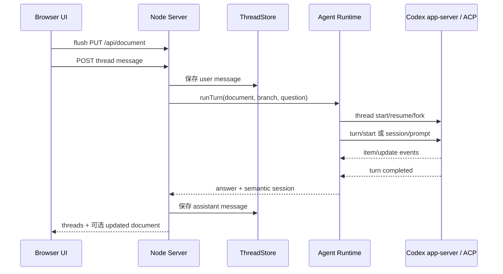

# 玄鸟 — 当前产品、技术实现与架构说明

> 本文以当前工作区代码为准，描述已经实现的能力、真实运行方式、架构边界和下一步演进方向。规划中的能力会明确标注，不再与现状混写。

## 1. 产品定义

玄鸟是一个本地优先（Local-first）的 AI Markdown 文档协作工具。用户在浏览器中编辑本地 Markdown 文件，围绕选中文本创建评论线程，并通过原生 Codex app-server 或 ACP 兼容传输进行多轮讨论。

这里的“本地优先”具体指：

- Markdown 原文件直接保存在本地文件系统。
- Thread、消息和协议无关的 Agent session 引用保存在用户 home 目录下的本地元数据文件中。
- Browser UI、Node Server 和 Agent Runtime 都在本机运行。
- 不提供云端文档托管、云同步或多人实时协作。
- Codex 最终使用本地模型还是远端模型、是否访问网络，由 Codex CLI 或兼容 adapter 的配置决定；玄鸟当前不承诺完全离线推理。

“协作”特指用户与 AI 围绕文档协作，不是多人协同编辑。

### 1.1 核心定位

- 文档中心，而不是聊天中心。
- Markdown 源文本是唯一文档事实源。
- Thread 绑定具体文本范围，而不是独立于文档存在。
- 浏览器负责编辑和交互，本地 Server 负责文件、Thread 与 Agent Runtime 协调。
- 当前是单用户、单 Server 实例、单活动文档的本地工具。

### 1.2 适用场景

- PRD、RFC、ADR 和技术方案编写
- 架构说明与 Mermaid 图审阅
- API 边界条件和异常路径梳理
- 测试用例生成
- 本地 Markdown 文档问答与改写

### 1.3 当前不做

- 多人实时协作、OT 或 CRDT
- 云同步和 SaaS 后端
- 富文本或所见即所得编辑
- 完整 IDE 能力
- 多租户、账号和复杂权限系统

## 2. 当前实现状态

### 2.1 功能总览

| 能力 | 状态 | 当前实现 |
| --- | --- | --- |
| 打开 Markdown | 已实现 | 启动时指定文件；应用内按目录浏览；支持绝对路径和 workspace 外文件 |
| Markdown 编辑 | 已实现 | CodeMirror 6 源码编辑、语法高亮、自动换行、编辑器内 undo/redo |
| 自动保存 | 已实现 | 编辑停止 1 秒后保存；切换文档或询问 Codex 前先 flush；支持手动 Save |
| Preview | 已实现 | markdown-it 渲染；禁用原始 HTML；支持 Mermaid |
| Outline | 已实现 | 服务端生成轻量 block index，前端展示 heading 并跳转到对应行 |
| 文本选区 | 已实现 | Edit 使用精确字符范围；Preview 使用 source line 和文本恢复源位置 |
| Anchored Thread | 已实现 | 选区、消息、Agent session 持久化；编辑后自动 remap |
| 多轮 Codex 对话 | 已实现 | 每个 conversation node 独立原生 Codex thread；支持 resume 与从父 turn 精确 fork |
| 消息管理 | 已实现 | 编辑用户消息、重跑回复、重试 Codex、删除消息、删除 thread |
| Thread/文档联动 | 已实现 | 标记选区、激活跳转、侧栏与文档滚动位置同步 |
| Mermaid 查看 | 已实现 | Preview 本地渲染、横向查看、全屏缩放 |
| Agent 访问模式 | 已实现 | 默认 `full-access`，可切换为 `read-only`；命令、文件和额外权限请求进入浏览器审批 |
| Codex 模型设置 | 已实现 | 设置页动态读取 `model/list`；模型与推理深度持久化，并从下一轮提问生效 |
| Agent session 恢复 | 已实现 | 原生模式保存 thread/turn ID 并调用 `thread/resume`；ACP 兼容模式使用 `session/load` |
| Agent 直接修改文件 | 已实现 | Runtime 可按沙箱和审批策略修改文件；返回后重新读取当前文档并校准 thread |
| 受控选区替换 | 实验性、默认关闭 | `XUANNIAO_CONTROLLED_REPLACEMENT=1` 时按意图识别并替换当前选区 |
| Patch/Diff 审核 | 未实现 | 没有 patch 数据模型、diff preview、确认后 apply 流程 |
| 实时流式回复 | 未实现 | 服务端保留原生事件与 ACP update，但浏览器等待完整 HTTP 响应 |
| Tool Call 展示 | 未实现 | 仅把压缩后的 update 写入消息 meta，没有可见执行时间线 |
| 人工权限弹窗 | 已实现 | 前端轮询并渲染权限卡片；服务端挂起 Runtime 请求，等待用户 Allow/Deny |
| 外部文件监听 | 未实现 | 没有 chokidar/fs.watch；仅在保存或一次 Agent turn 结束后重新读取 |
| Git/快照历史 | 未实现 | 没有 Git 集成、版本列表、文档快照或 patch 回滚 |
| MCP/插件/导出 | 部分实现 | 原生 app-server 继承 Codex CLI 的 MCP 与 skills 配置；玄鸟没有单独的管理 UI 或导出能力 |

### 2.2 当前用户流程


用户在 Edit 或 Preview 中选中文本后，点击右侧“选中文字提问”，通过选区旁的内嵌提问框输入问题。相同范围已有 thread 时会复用该 thread。

右侧 Thread Rail 支持：

- 按文档位置排列评论卡片。
- 与 Edit/Preview 的滚动位置同步。
- 点击 thread 跳到对应文本，双击展开或折叠消息。
- Thread 工作区按“文档预览 / 节点 content / Tree”三栏联动展示；切换 Tree 节点时文档预览自动定位当前 Thread 原文锚点，并使用与主 Preview 相同的激活高亮；两条分隔线支持拖动或键盘调整宽度。
- Tree 总览和节点 content 使用互斥创建入口：叶子节点只创建子节点，已有子路径的节点只创建独立分支；新节点始终直接挂到当前节点，不重排既有路径，连接线不提供创建按钮。
- 上一个/下一个 thread 导航。
- 编辑用户问题并保存时始终重新询问 Codex；刷新后未回答的节点可显式恢复请求。
- 重试或删除 Codex 回复。
- 删除完整 thread。

## 3. 当前技术栈

| 层 | 当前技术 | 说明 |
| --- | --- | --- |
| Web UI | React 19 + TypeScript | 使用 React 本地 state，没有 Zustand |
| Build/Dev | Vite 7 | 开发服务器代理 `/api` 到 Node Server |
| Editor | CodeMirror 6 | Markdown 源码编辑、history、selection、Decoration |
| Markdown Preview | markdown-it 14 | HTML 关闭；renderer 注入源行信息 |
| Diagram | Mermaid 11 | `securityLevel: strict`，浏览器本地渲染 |
| Styling | 原生 CSS | 没有 Tailwind |
| Server | Node.js 20.19.x / 22.12+，ESM JavaScript | 使用内置 `http` 和文件系统 API，没有 Web 框架 |
| Browser/Server 通信 | REST + JSON | 没有 WebSocket 或 SSE |
| Agent Runtime | stdio JSONL / JSON-RPC | 默认直连 `codex app-server`；可切换 ACP adapter |
| Thread 持久化 | 本地 JSON | 每个文档一个 `threads.json` |
| Markdown 索引 | 自定义轻量行解析器 | 识别 heading、paragraph、无序 list、反引号 fenced code |
| Tests | Node test runner + TypeScript check | 单元测试覆盖 Runtime、上下文策略、store、file browser、anchor remap |

早期未参与运行的 Rust 壳工程已经移除。当前可运行产品路径完全是 Node + Vite；`codex xuanniao design.md` 形式的 CLI 尚未实现。

## 4. 系统架构

### 4.1 运行时架构

```text
┌──────────────────────────── Browser / React ────────────────────────────┐
│ TopBar / DocumentPane / ThreadRail / FilePickerModal / DiagramViewer     │
│ App.tsx：页面组合；业务流程下沉到 document/conversation/permission hooks │
│ MarkdownThreadEditor：CodeMirror、选区、Decoration、编辑后 anchor remap   │
│ markdown.ts：Markdown/消息渲染与按需加载 Mermaid                          │
└────────────────────────────── REST / JSON ──────────────────────────────┘
                                      │
┌──────────────────────────── Node HTTP Server ───────────────────────────┐
│ server/index.js：HTTP 适配与依赖组合                                      │
│ ConversationService / ConversationModel：用例编排与领域状态迁移          │
│ DocumentWorkspace / ThreadStore：文档事务与元数据持久化                   │
│ Agent Runtime：session、上下文、事件、fork/resume 与 approval broker      │
└────────────────────────── semantic runtime API ──────────────────────────┘
                                      │
              Codex app-server（原生） · ACP adapter（兼容）
                                      │
                  本地 Markdown + ~/xuanniao 元数据
```

一个 Server 进程只有一个活动文档：

- 活动文档对应一个 Agent Runtime 句柄；`codex app-server` 或 ACP 子进程只在第一次 Agent 请求时按需启动。
- 每个 conversation node 对应一个 Agent session；同一节点复用 session，子节点从父节点最后成功 turn fork。
- 切换文档时创建新的文档上下文并替换 ThreadStore，随后释放旧 Runtime；Agent CLI 不可用不会阻断文档打开与编辑。
- 原生 Runtime 只串行化同一 session，不同分支可以并行；ACP 兼容 adapter 仍按进程串行。
- ThreadStore 对 mutation 使用单实例串行队列，避免并行分支完成时相互覆盖 JSON 更新。

### 4.2 前端模块

| 模块 | 文件 | 责任 |
| --- | --- | --- |
| 入口 | `web/src/main.tsx` | 挂载 React 应用 |
| 应用编排 | `web/src/App.tsx` | 页面组合、文件选择和跨区域联动 |
| 文档区域 | `web/src/components/DocumentPane.tsx` | Edit、Preview、Outline 三种视图 |
| 编辑器适配器 | `web/src/ThreadEditor.ts` | 隐藏 CodeMirror 初始化、选区、Decoration、定位和空间信息 |
| Thread 侧栏 | `web/src/components/ThreadRail.tsx` | 评论卡片、消息操作、空间布局和滚动同步 |
| 文件浏览 | `web/src/components/FilePickerModal.tsx` | 目录导航、搜索、绝对路径输入和 Markdown 文件打开 |
| 图表查看 | `web/src/components/DiagramViewer.tsx` | Mermaid SVG 全屏与缩放 |
| Markdown 渲染 | `web/src/markdown.ts` | Preview、消息 Markdown、Mermaid fence renderer |
| Preview 副作用 | `web/src/hooks/useRenderedPreview.ts` | 渲染、thread block 标记、图表点击处理 |
| 文档用例 | `web/src/hooks/useDocumentSession.ts` | revision、保存队列、自动保存与 compare-and-swap |
| 会话用例 | `web/src/hooks/useConversationCommands.ts` | 消息草稿、发送、编辑、重试、删除与显式 Agent 结果 |
| 权限收件箱 | `web/src/hooks/usePermissionInbox.ts` | 权限轮询、稳定状态比较与决定提交 |
| Agent 设置 | `web/src/hooks/useAgentSettings.ts` | 模型目录加载、设置保存与请求生命周期 |
| 消息选区 | `web/src/hooks/useMessageSelection.ts` | 选区生命周期、引用捕获与提问浮层 |
| Anchor 定位 | `web/src/thread-anchors.ts` | 精确位置校验、文本恢复、context 匹配、排序 |
| Anchor remap | `web/src/thread-anchor-remap.ts` | CodeMirror change set 到 thread range 的映射 |
| 空间布局 | `web/src/thread-spatial.ts` | Preview block 与 Thread Rail 的纵向对齐 |
| API | `web/src/api.ts` | REST 请求封装 |
| 类型 | `web/src/types.ts` | Document、Block、Anchor、Thread、Message 等类型 |

`App.tsx` 负责页面级组合与跨区域联动；文档、会话、权限和消息选区状态已经下沉到独立 hooks。`ThreadRail.tsx` 仍包含评论栏、树画布和节点详情三种视觉编排，是前端剩余的主要组件复杂度集中点。

### 4.3 服务端模块

| 模块 | 文件 | 责任 |
| --- | --- | --- |
| Server 入口 | `server/index.js` | 参数解析、活动文档上下文、REST、静态资源与依赖组合 |
| HTTP 安全 | `server/lib/http-security.js` | 绑定地址、Host/Origin、JSON 媒体类型与安全响应头 |
| 会话应用服务 | `server/lib/conversation-service.js` | 消息命令、Agent 回合和受控文档修改编排 |
| 会话领域模型 | `server/lib/conversation-model.js` | 问题放置、状态迁移、分支校验和 session 失效 |
| 文档事务 | `server/lib/document-workspace.js` | revision、原子保存、canonical anchor 与活动文档保护 |
| Runtime 组合 | `server/lib/agent-runtime.js` | 传输选择、公共配置归一化和应用边界 |
| Agent 设置 | `server/lib/agent-settings.js` | 模型目录归一化、模型与推理深度能力校验 |
| 设置存储 | `server/lib/agent-settings-store.js` | 全局 Codex 偏好的原子持久化 |
| JSONL 进程 | `server/lib/json-line-rpc-process.js` | 子进程、请求关联、超时、退出处理和 stderr 诊断 |
| Codex Runtime | `server/lib/codex-app-server-runtime.js` | app-server 子进程、thread/turn、fork/resume、事件和审批 |
| Context Policy | `server/lib/agent-context.js` | 文档快照、增量变更、分支历史和受控替换规则 |
| ACP Client | `server/lib/acp-client.js` | ACP 兼容 session、update、文件接口和审批适配 |
| Thread Store | `server/lib/thread-store.js` | Thread JSON 读写、迁移、锁与 mutation 串行化 |
| 元数据路径 | `server/lib/metadata-paths.js` | 文档绝对路径到本地元数据目录的映射 |
| Anchor 校准 | `server/lib/thread-anchor-remap.js` | Agent 或外部写入后恢复、移动或删除 thread |
| Block Index | `server/lib/block-index.js` | 为 Outline 生成派生 block 列表 |
| File Browser | `server/lib/file-browser.js` | 目录浏览和 Markdown 文件过滤 |

`server/index.js` 只保留 HTTP 适配与依赖组合；会话规则、Agent 用例、文档事务和持久化分别由领域模型、应用服务、DocumentWorkspace 与 ThreadStore 承担。当前仍没有 Patch Manager、WebSocket 层或 Markdown AST 写回层。

## 5. 核心数据流

### 5.1 启动与文档切换

1. 解析启动参数，默认文档为 `prd.md`。
2. 启动时文档不存在则创建空文件。
3. 创建文档对应的 ThreadStore、DocumentWorkspace、ConversationService 和惰性 Agent Runtime。
4. HTTP Server 立即可用；Agent 子进程在第一次 Agent turn 时才启动。
5. Browser 并行请求当前文档、threads 和 workspace 文件列表。
6. 切换文档前先保存未提交编辑，再原子替换请求级文档上下文并释放旧 Runtime。

### 5.2 编辑与保存

```text
CodeMirror transaction
  → 更新 Markdown 字符串
  → remap 所有 thread anchor
  → 标记被完整删除的 thread
  → 1 秒 debounce
  → PUT /api/document
  → 同时写入文档内容和最新 anchor
  → 返回重新生成的 document payload
```

Document payload 携带路径和 SHA-256 revision。浏览器保存绑定文档会话并使用 compare-and-swap，服务端同时校验文档路径；Thread metadata 和 Markdown 通过临时文件与 rename 原子落盘。检测到切换或外部修改时返回冲突，不会静默覆盖。

### 5.3 向 Codex 提问



这是同步 HTTP 请求。前端先显示临时 “Working with local Codex...” 消息，但只有 Agent turn 完成后才收到真实回复。

### 5.4 Agent 修改文档

文档写入统一收口到 `DocumentWorkspace`：

1. Browser 通过 `PUT /api/document` 保存完整 Markdown。
2. 开启 `XUANNIAO_CONTROLLED_REPLACEMENT=1` 后，Server 解析 Codex replacement 并通过同一事务入口替换选区。

活动 Markdown 是受保护资源：ACP 文件写直接拒绝；每个 Agent turn 前后记录文档快照，发现绕过事务的直接写入时保留当前文件并返回冲突，避免旧快照覆盖未知外部修改。full-access Codex 仍缺少操作系统级单文件隔离，因此该 turn 后校验是保护层而不是内核强制边界。

## 6. Agent Runtime 实现

### 6.1 稳定边界与能力协商

`server/index.js` 只依赖语义接口：

```text
start / dispose / status
runTurn(question, document, branch, mode) → answer + AgentSession
listPermissionRequests / resolvePermissionRequest
```

协议选择、进程启动和 wire format 被封装在 adapter 内。`status()` 明确报告 resume、fork、跨 session 并发、审批代理、增量文档上下文和事件流等能力，避免把 ACP 的最低能力误当成所有 Agent 的共同上限。

当前浏览器尚未实现结构化 `request_user_input`、MCP elicitation 和动态 client tool 表单，Runtime 会在 capability 中明确报告为 `false`；未知 server request 返回协议错误，Agent 可退回普通文本交互，不伪装成已支持。

### 6.2 原生 Codex 生命周期

```text
spawn codex app-server
  → initialize / initialized
  → 根节点：thread/start
  → 已保存节点：thread/resume
  → 子分支：thread/fork(parent thread, parent lastTurnId)
  → turn/start
  → item/started · delta · item/completed
  → turn/completed
```

原生 Runtime 不覆盖 Codex 的 approval policy，继续使用 Codex CLI 和组织策略；玄鸟只根据访问模式设置 `read-only` 或 `danger-full-access` sandbox。设置页通过 `model/list` 获取当前目录，并在后续 `thread/start` / `turn/start` 传递已保存的模型与推理深度；没有覆盖时交给 Codex 默认值。修改设置只更新 Runtime 的后续回合参数，不销毁活动 session，也不中断正在运行的 turn。

### 6.3 Session 与树一致性

每个 conversation node 保存：

```ts
type AgentSession = {
  adapter: string
  sessionId: string
  turnId: string | null
  documentHash: string | null
}
```

同一节点继续对话时复用其 session；新子节点从父节点最近成功 turn fork，因此 Agent 可见历史与 UI 路径一致。编辑或删除问题、删除回答、继续一个已有子分支的父节点时，ThreadStore 会清除受影响节点或后代的 session；下一次调用会从仍可信的父节点 fork，或根据本地分支历史重建。新节点只允许直接追加到指定父节点，旧的插入和子树重排参数会在领域边界被拒绝。

每次调用还会携带当前 lineage revision。Agent 完成时，ThreadStore 在写入回答与 AgentSession 的同一 mutation 中重新校验 revision；如果祖先路径在运行期间改变，旧回答不会提交，而是要求重试。

旧版 `acpSessionId` 在读取 version 1/2 sidecar 时迁移为 `adapter: "acp"` 的 AgentSession；新写入格式为 version 3。

### 6.4 上下文策略

- 新建或必须重建的 session 注入完整文档快照和当前分支历史。
- 已恢复且文档 hash 未变化时，只发送当前问题、选区与必要焦点，不重复完整正文和历史。
- 小范围文档变化发送带 offset、删除文本、插入文本和前后上下文的精确 splice。
- 大范围变化或进程重启后缺少旧快照时，重新发送完整文档。
- 上下文超过显式字符预算时失败并提示，不会静默截断；文档快照使用有界 LRU 缓存。
- 原生 fork 继承祖先历史，只补当前节点重建所需的消息；兄弟分支永不注入。
- ACP adapter 在新 session 或恢复失败时回退到完整分支历史；已恢复 session 使用增量上下文。

### 6.5 审批与事件

Codex 的 command、file change 和 additional permissions 请求会转成统一 PermissionRequest，挂起原协议请求并等待浏览器选择。Allow once、Allow for session、Reject 和 Cancel 会映射回协议原生 decision。ACP `session/request_permission` 使用同一个审批队列，不再根据访问模式自动代替用户选择。

Runtime 保留 agent message delta 和 item 生命周期更新；当前 HTTP API 在 turn 完成后一次性返回正文，前端流式展示仍是后续工作。

原生 turn 使用 10 分钟活动空闲超时，Agent 输出和工具事件会自动续期，等待用户审批时暂停计时。连续无活动超时后 Runtime 会发送 `turn/interrupt` 并继续持有当前 session lock；若宽限期内仍收不到终态，则重启 app-server 并失败掉其它在途 turn，确保超时任务不能在后台继续修改工作区。迟到事件和抢跑事件均有数量边界。

### 6.6 ACP 兼容模式

设置 `XUANNIAO_AGENT_TRANSPORT=acp` 后使用 `codex-acp`：

- 支持 `session/new` 和 adapter 声明的 `session/load`。
- 继续提供 ACP 文件接口和 update 事件。
- 不声明原生 fork 能力；分支通过新 session 与本地祖先历史恢复。
- 因一个 adapter 进程只维护一个 active turn，prompt 仍全局串行。
- prompt 使用活动空闲超时：update 事件会续期，等待权限选择时暂停；连续无活动超时后 adapter 会被终止并在下一轮重建，旧 session 和迟到事件不会复用。

## 7. 文档、Block 与 Thread Anchor

### 7.1 Markdown 是事实源

当前实现直接读写 Markdown 字符串。Block index 是每次读取文档时生成的派生数据，仅用于 Outline 和源行定位，不参与文档写回。

这意味着原设计中的 `remark/mdast`、AST mutation 和稳定 block ID 均未实现。当前 block ID 根据类型、起始行和内容 hash 生成，移动或修改 block 后可能变化。

### 7.2 Anchor 数据

```ts
type Anchor = {
  start: number | null
  end: number | null
  lineStart: number | null
  lineEnd: number | null
  blockId: string | null
  contextBefore?: string | null
  contextAfter?: string | null
}
```

当前 thread 的主定位依据是字符范围、选中文字、行号和前后各最多 32 个字符的上下文。`blockId` 字段保留在类型中，但当前创建 thread 时始终为 `null`，不是实际绑定主键。

### 7.3 编辑后的 remap 规则

- 选区之前的编辑：平移 `start/end`。
- 选区内部的编辑：扩大或缩小范围，并更新 `selectedText`。
- 完整非空替换：只保留发起该替换的 thread，并绑定到替换文本。
- 完整删除：删除该 thread。
- 更大范围替换覆盖其他 thread：删除被覆盖的其他 thread。
- 旧范围失效：按标准化后的 `selectedText` 搜索，优先原行附近和 context 更匹配的位置。
- Agent 或其他进程写入后：服务端重新校准全部 thread；无法恢复的 thread 会被删除。

Preview 当前只能把 thread 标记到对应的渲染 block，不会精确包裹 block 内的局部文字；Edit 使用 CodeMirror Decoration 精确标记字符范围。

## 8. 数据持久化

### 8.1 文件位置

Markdown 保留在原始路径。Thread 元数据按文档绝对路径的 SHA-256 分目录保存：

```text
~/xuanniao/<sha256(document-absolute-path)>/threads.json
```

旧版 sidecar 存在且新位置不存在时，会一次性复制：

```text
<document-dir>/.xuanniao/<document-name>.threads.json
  → ~/xuanniao/<sha256>/threads.json
```

### 8.2 当前数据模型

```ts
type DocumentPayload = {
  path: string
  title: string
  content: string
  blocks: Block[]
}

type Thread = {
  id: string
  title: string
  selectedText: string
  anchor: Anchor
  messages: Message[]
  createdAt: string
  updatedAt: string
}

type Message = {
  id: string
  role: "user" | "assistant"
  content: string
  nodeId?: string | null
  parentId?: string | null
  agentSession?: AgentSession | null
  error?: boolean
  meta?: Record<string, unknown>
  createdAt: string
  updatedAt?: string
}
```

ThreadStore 每次操作都读取并重写完整 JSON 文件；同一路径的所有 Store 实例共享进程内 Promise mutation lock，防止并行 Agent 分支和 anchor 校准丢失更新。当前仍没有跨进程事务、通用 schema migration 框架或损坏恢复机制。

## 9. REST API

| Method | Path | 用途 |
| --- | --- | --- |
| GET | `/api/health` | Server、活动文档和 Agent Runtime 状态/能力 |
| GET | `/api/files` | 递归列出 workspace 内最多 500 个 Markdown 文件 |
| GET | `/api/files/browse?path=...` | 浏览指定目录或选择指定 Markdown 文件 |
| GET | `/api/document` | 读取活动文档和 block index |
| POST | `/api/document/open` | 切换活动 Markdown 文档 |
| PUT | `/api/document` | 保存完整文档和 thread anchors |
| GET | `/api/threads` | 读取当前文档的 threads |
| POST | `/api/threads` | 创建或复用选区 thread |
| DELETE | `/api/threads/:id` | 删除 thread |
| POST | `/api/threads/:id/messages` | 保存消息并可选询问 Codex |
| PUT | `/api/threads/:id/messages/:messageId` | 编辑用户消息并可选重跑 Codex |
| PATCH | `/api/threads/:id/messages/:messageId/meta` | 更新允许的消息领域元数据 |
| DELETE | `/api/threads/:id/messages/:messageId` | 删除消息；用户消息可连带删除紧随的回复 |
| GET | `/api/permissions` | 获取待处理权限请求 |
| POST | `/api/permissions/:id/resolve` | 提交权限选择并恢复挂起的 Runtime 请求 |

请求体上限为 8 MiB。默认只允许回环地址、回环 Host/Origin，并要求变更 API 使用 `application/json`；响应包含安全头和 request ID。系统仍没有用户认证或多租户隔离，远程监听只能通过 `XUANNIAO_UNSAFE_ALLOW_REMOTE=1` 显式开启，并仅适用于可信单用户网络。

## 10. 文件浏览与安全边界

支持的扩展名：

```text
.md .markdown .mdown .mkdn
```

当前文件选择器是浏览器内的目录浏览 UI，不是系统原生文件选择器：

- 可以输入绝对路径，因此能打开 workspace 外的 Markdown。
- 隐藏目录不会显示。
- 目录浏览忽略 `node_modules` 和 `dist`。
- workspace 递归列表另外忽略 `.git`、`.xuanniao` 等目录。

Server 默认监听 `127.0.0.1`。不应在没有额外认证和路径限制的情况下监听公网地址，因为 full-access Agent 和文件浏览都可能访问 workspace 外路径。

## 11. 运行与配置

### 11.1 依赖

- Node.js 20.19.x，或 22.12+
- npm
- Codex CLI，默认命令为 `codex app-server`

安装：

```bash
npm ci
codex login
```

### 11.2 开发运行

推荐：

```bash
make run FILE=prd.md
```

该命令启动：

- Node API：`http://127.0.0.1:4173`
- Vite Web：`http://127.0.0.1:5173`
- 默认浏览器

自定义端口：

```bash
make run SERVER_PORT=4174 WEB_PORT=5174 FILE=docs/design.md
```

### 11.3 构建运行

```bash
npm run web:build
npm start -- prd.md
```

Node Server 检测到 `web/dist/index.html` 时会提供构建后的静态资源。

### 11.4 环境变量

模型和推理深度也可以在应用设置页中选择，持久化路径为 `~/xuanniao/settings.json`。环境变量仅作为设置文件不存在时的初始默认值；保存设置后，本机设置优先。

| 变量 | 默认值 | 作用 |
| --- | --- | --- |
| `HOST` | `127.0.0.1` | Node Server 地址 |
| `PORT` | `4173` | Node Server 端口 |
| `XUANNIAO_AGENT_TRANSPORT` | `codex` | `codex` 原生模式或 `acp` 兼容模式 |
| `XUANNIAO_AGENT_MODE` | `full-access` | `full-access` 或 `read-only` |
| `XUANNIAO_AGENT_TIMEOUT_MS` | `600000` | 原生与 ACP turn 活动空闲超时 |
| `XUANNIAO_CODEX_CMD` | `codex app-server` | 原生 Codex app-server 命令 |
| `XUANNIAO_CODEX_MODEL` | 未设置 | 可选模型覆盖；默认使用 Codex 配置 |
| `XUANNIAO_CODEX_REASONING_EFFORT` | 未设置 | 可选推理强度覆盖；默认使用 Codex 配置 |
| `XUANNIAO_ACP_CMD` | `codex-acp` | ACP 兼容 adapter 命令 |
| `XUANNIAO_ACP_TIMEOUT_MS` | 通用超时 | ACP 活动空闲超时覆盖 |
| `XUANNIAO_ACP_SKIP_AUTH` | 未设置 | 设置为 `1` 时允许 adapter 使用已有认证 |
| `XUANNIAO_CONTROLLED_REPLACEMENT` | 未设置 | 设置为 `1` 时启用实验性选区替换 |
| `XUANNIAO_AGENT_CONTEXT_MAX_CHARS` | `1500000` | Agent 单次上下文字符上限 |
| `XUANNIAO_AGENT_SNAPSHOT_CACHE_ENTRIES` | `32` | 文档快照 LRU 最大条目数 |
| `XUANNIAO_UNSAFE_ALLOW_REMOTE` | 未设置 | 设置为 `1` 时显式允许非回环监听 |
| `XUANNIAO_API_HOST` | `127.0.0.1` | Vite proxy 的 API 地址 |
| `XUANNIAO_API_PORT` | `4173` | Vite proxy 的 API 端口 |

## 12. 测试与当前质量基线

统一检查命令：

```bash
npm run check
```

它依次执行：

- Server JavaScript 语法检查
- Frontend TypeScript `tsc --noEmit`
- 源码换行、缩进与尾随空白检查
- Node test runner 单元测试
- Vite production build

截至当前代码，125 个测试全部通过。覆盖范围包括：

- 原生 Codex session start/resume/fork、事件归并、审批挂起和上下文去重
- Codex 模型目录分页、设置能力校验、环境变量回退和原子持久化
- ACP 模式映射、文件写权限、session new/load/fallback、审批和启动失败
- ThreadStore 路径、AgentSession 迁移、树变更失效规则和 anchor 删除同步
- 增量文档 splice、branch-only 上下文和文档 hash
- 前后端 thread anchor remap 与恢复
- Markdown 目录浏览
- 文档 revision 冲突、并发保存、anchor 持久化失败回滚
- 原生 turn interrupt 与 v2/legacy approval decision 映射
- 多 ThreadStore 实例对同一 sidecar 的进程内串行提交
- Conversation 领域规则与应用服务编排
- JSONL 子进程请求关联、超时与退出诊断
- HTTP Host/Origin/媒体类型安全边界与完整 Server 集成
- 前端会话状态、权限收件箱和消息选区文本规则

尚缺少：

- React 组件测试
- 自动化浏览器端到端测试
- 真实 Codex app-server 初始化与 model turn 已做手动冒烟验证；尚缺自动化 app-server 和 `codex-acp` 兼容性集成测试
- 进程崩溃注入和磁盘故障恢复测试

## 13. 主要技术风险

### 13.1 Agent 直接文件写入仍在事务边界之外

Browser 保存、Thread 创建和实验性 replacement 已收口到 `DocumentWorkspace`，统一执行 revision 校验、原子写入和 anchor 同步。ACP 直接写活动文档会被拒绝；Agent turn 后若发现无法归因的外部修改，会保留当前文件并返回冲突，不再用旧快照覆盖。但 `danger-full-access` 不能提供操作系统级单文件隔离，Agent 仍可能绕过应用事务写入活动文档，因此下一阶段应把受控 edit proposal 设为唯一写入路径。

### 13.2 外部修改缺少主动通知

Document payload 已携带 SHA-256 revision；Browser 保存和 replacement 使用 compare-and-swap，外部修改不会被静默覆盖。目前仍没有文件 watcher，冲突只能在下一次保存或 Agent 完成后的校准阶段被发现。

### 13.3 默认 full-access 范围过大

当前默认模式允许 Agent 在 `danger-full-access` sandbox 下工作；Codex 或 adapter 发起的显式审批会由用户处理，但并非每次文件写入都会产生审批。它适合受信任的本地开发环境，但与“文档修改应先预览确认”的产品目标仍不完全一致。

### 13.4 远程模式不是认证边界

默认回环监听包含 Host/Origin 校验，但 `XUANNIAO_UNSAFE_ALLOW_REMOTE=1` 只表示用户接受远程暴露风险，不会增加账号、会话或租户隔离。

### 13.5 大文档与持久化成本

Runtime 已避免在未变化的连续 turn 重发完整文档和历史，并增加显式上下文字符预算和有界快照缓存。但新建/重建 session 仍需要完整上下文，ThreadStore 也整文件读写，当前仍适合 MVP 文档规模。

### 13.6 编排模块过重

服务端领域、应用、事务和适配边界已拆分；前端文档、会话、权限与选区状态也已下沉。`ThreadRail.tsx` 仍同时编排评论栏、画布和节点详情，后续增加 streaming 或 diff 审核前仍有继续按视觉子区域拆分的空间。

## 14. 建议的演进架构

### Phase 1：稳定当前 MVP

1. 已引入统一 `DocumentWorkspace`，把 Browser 保存和受控 replacement 收口为一个入口：

```text
load current revision
  → validate base revision / anchor
  → compute proposed change
  → write document atomically
  → remap threads + persist answer/session in one metadata mutation
  → roll back document if metadata commit fails
  → return new revision
```

2. 已为 Document 增加 revision/hash，保存时检测外部冲突。
3. 增加文件 watcher；检测外部修改后 reload 或提示冲突，而不是静默覆盖。
4. 已将 Agent Runtime 改为按需初始化：Runtime 失败时仍能编辑文档，只影响 AI 请求。
5. Runtime 使用活动空闲超时，等待审批时暂停计时；超时后发送 `turn/interrupt` 并在失败时重启。用户主动取消仍待实现。
6. 已把 `App.tsx` 中的文档、会话、权限和选区流程拆成面向业务用例的 hooks；服务端会话用例下沉到 ConversationService。

### Phase 2：实现受控 AI 修改

1. Codex 返回结构化 edit proposal，而不是直接写文件。
2. proposal 保存 base revision、目标范围、replacement 和统一 diff。
3. Browser 展示 diff，用户确认后才调用统一 mutation 入口。
4. 支持 reject、apply、undo 和 snapshot。
5. 对 Agent 直接写当前文档的能力默认关闭；full-access 保留给明确授权的仓库级任务。

目标流程：

```text
Ask Codex
  → Edit Proposal
  → Validate Base Revision
  → Diff Preview
  → User Confirm
  → Atomic Apply
  → Remap Threads
  → Snapshot
```

### Phase 3：改善交互与可观测性

- 使用 SSE 或 WebSocket 流式传递 assistant chunk、tool call、plan 和错误。
- 支持用户主动取消 turn，并补充更明确的 Agent 状态。
- 完成用户可见的 permission flow。
- 增加本地评论按钮，不必每条消息都调用 Codex。
- 用内嵌 composer 取代 `window.prompt`，增加 Explain/Expand/Rewrite 等快捷动作。

### Phase 4：按需求扩展

- SQLite metadata 与 schema migration
- Git history、commit/diff 浏览和回滚
- 多活动文档或 agent 缓存
- 可配置 MCP server
- 导出与插件系统

多人协作、云同步和 SaaS 仍不在默认路线内。

## 15. 核心设计原则

1. **Markdown source of truth**：原文件内容优先于缓存、session 和派生索引。
2. **Range-anchored threads**：当前以字符范围、文本、行号和 context 组合定位，不把易变 block ID 当作唯一依据。
3. **One mutation path**：所有文档写入最终应经过同一验证、写入、remap 和持久化入口。
4. **Explicit AI edits**：讨论可以自动进行，文档修改应形成可审查的 proposal。
5. **Local by default**：文档和协作元数据留在本机，同时明确模型和网络边界。
6. **Deep module boundaries**：Editor、Agent Runtime、Thread Store 和 Document Mutation 应隐藏各自实现细节；页面和路由只编排用户用例。
7. **Derived indexes are disposable**：Block index、Preview marker 和空间布局都可从 Markdown 与 Thread 数据重新生成。
